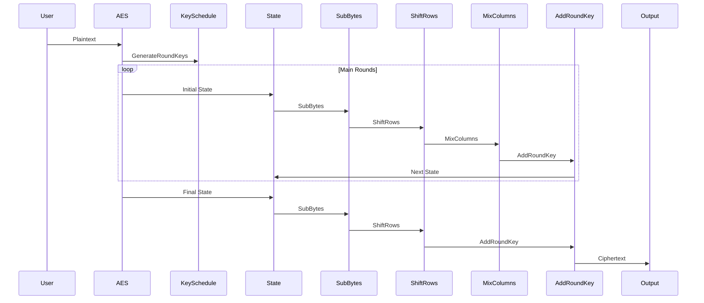

## Greek Symbol Key
- $\alpha$: Input variables, representing initial values or keys.
- $\Phi$: General transformation or function.
- $\Psi$: XOR logic operation or another binary operation.
- $\Lambda$: Function for key generation.
- $\Omega$: Encryption function.
- $\Theta$: Decryption function.
- $\eta, \xi$: Large prime numbers or composite numbers.
- $\Gamma$: Function for pseudo-random values or sequences.
