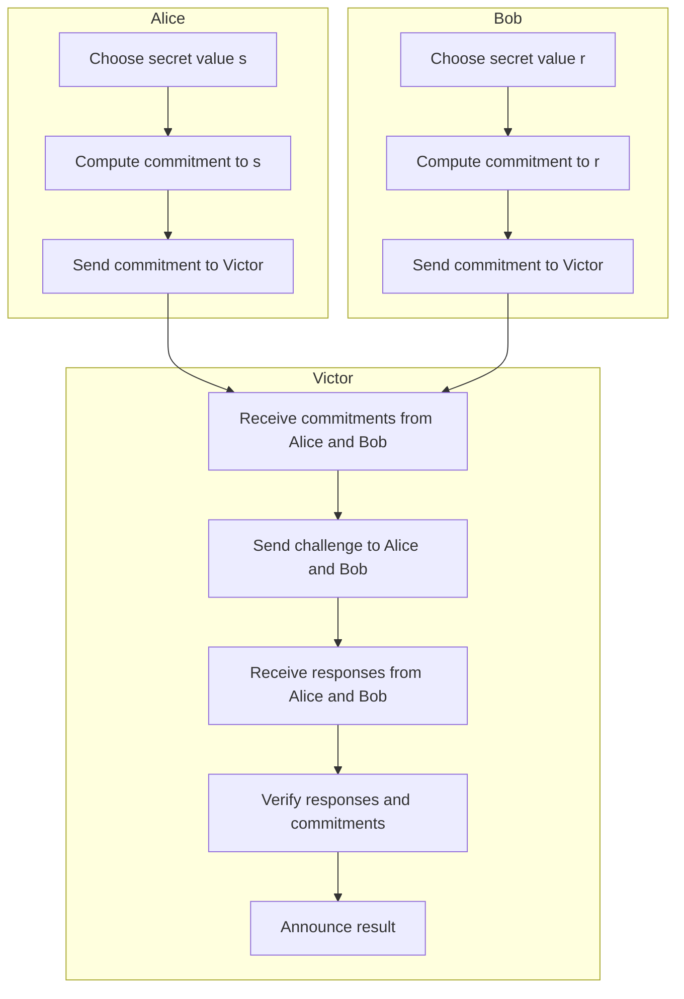
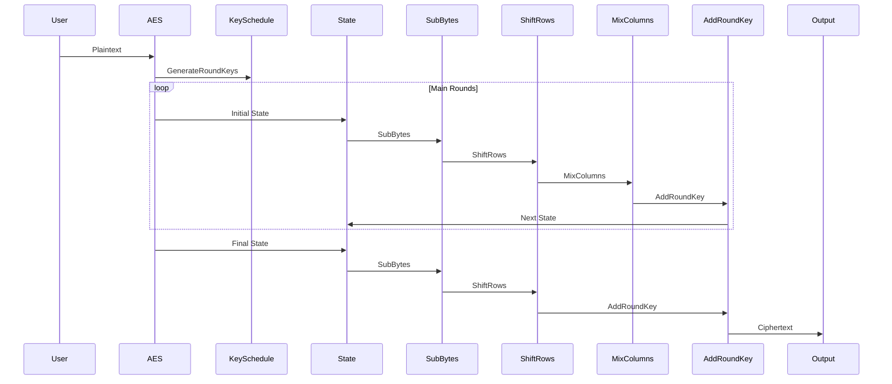
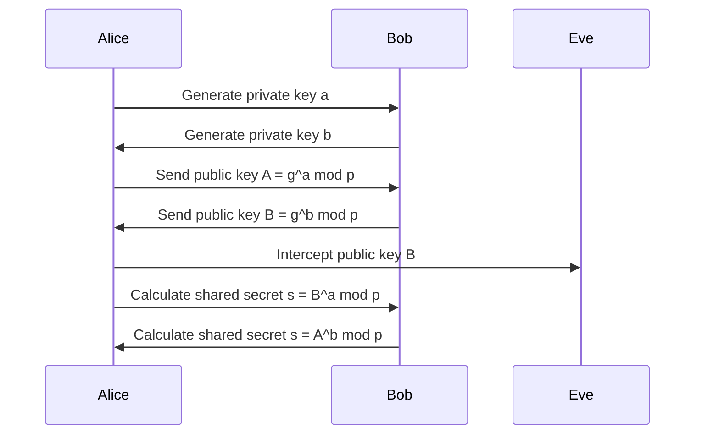
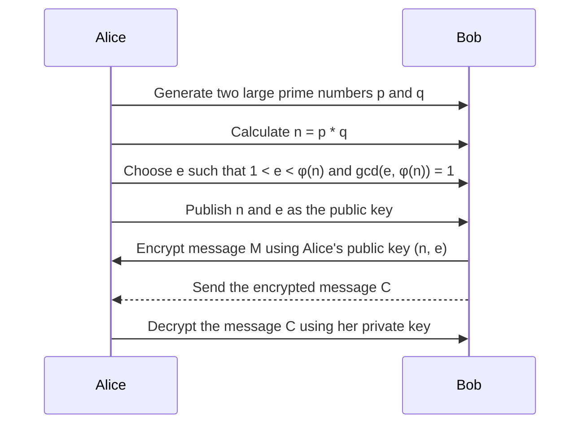
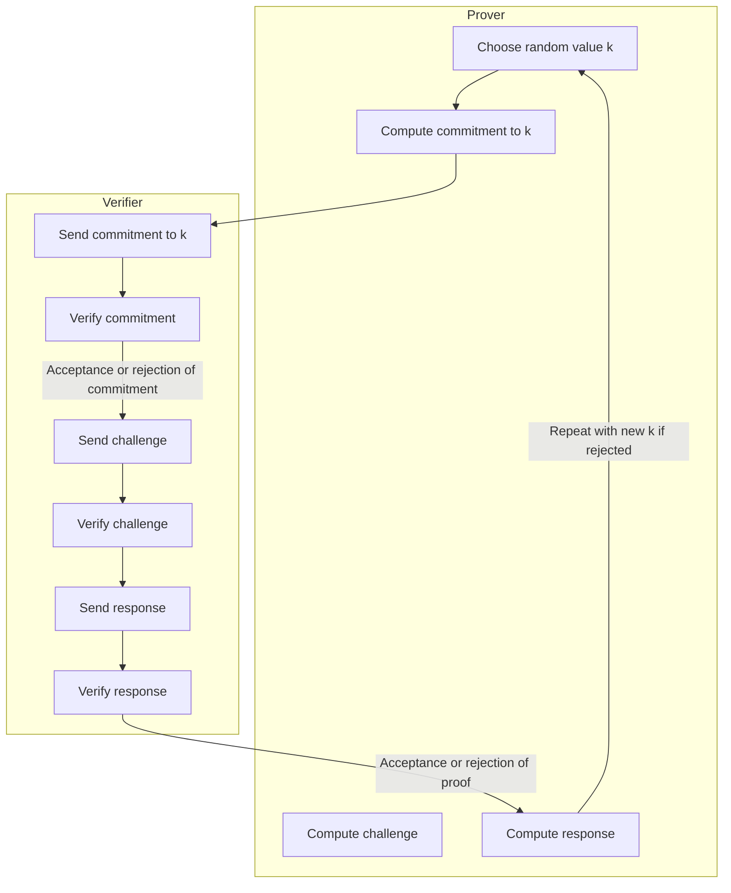
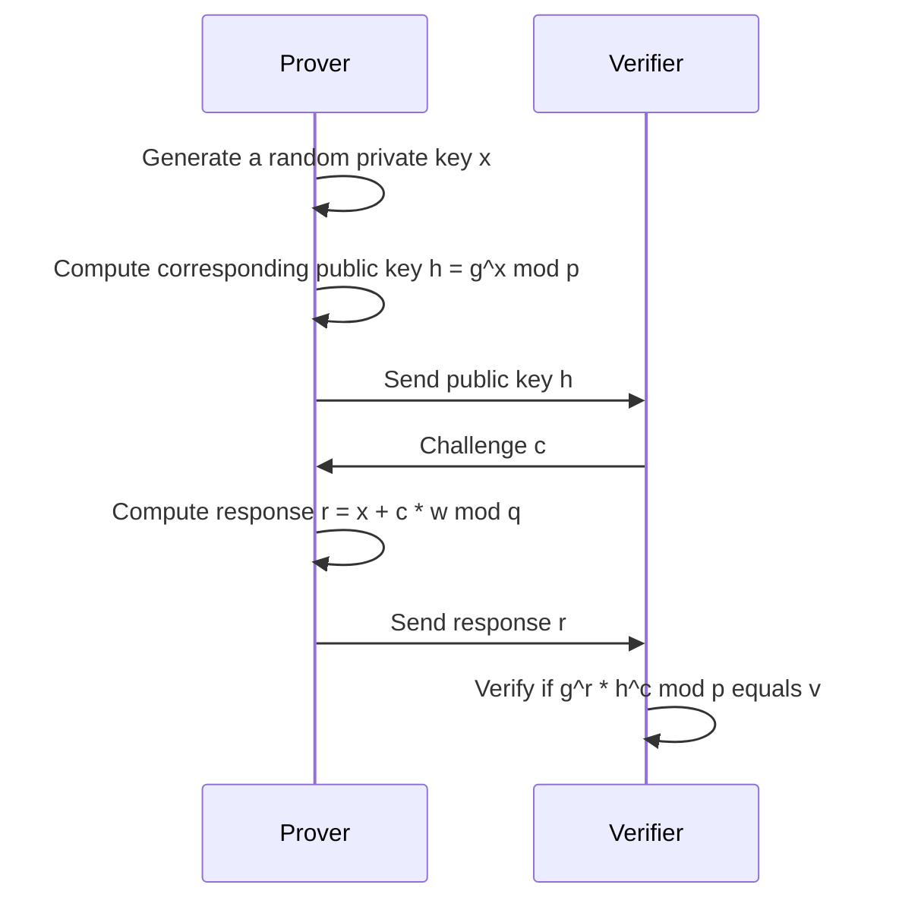
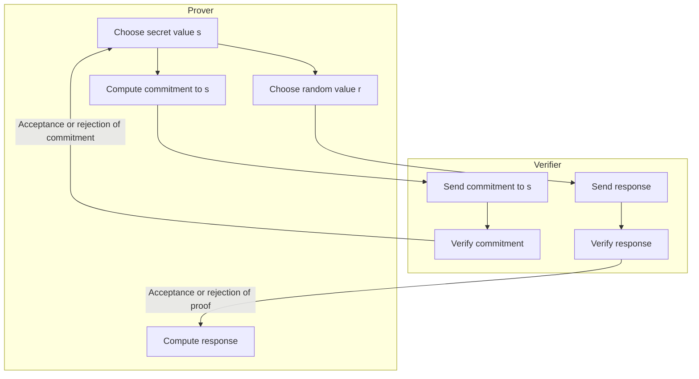
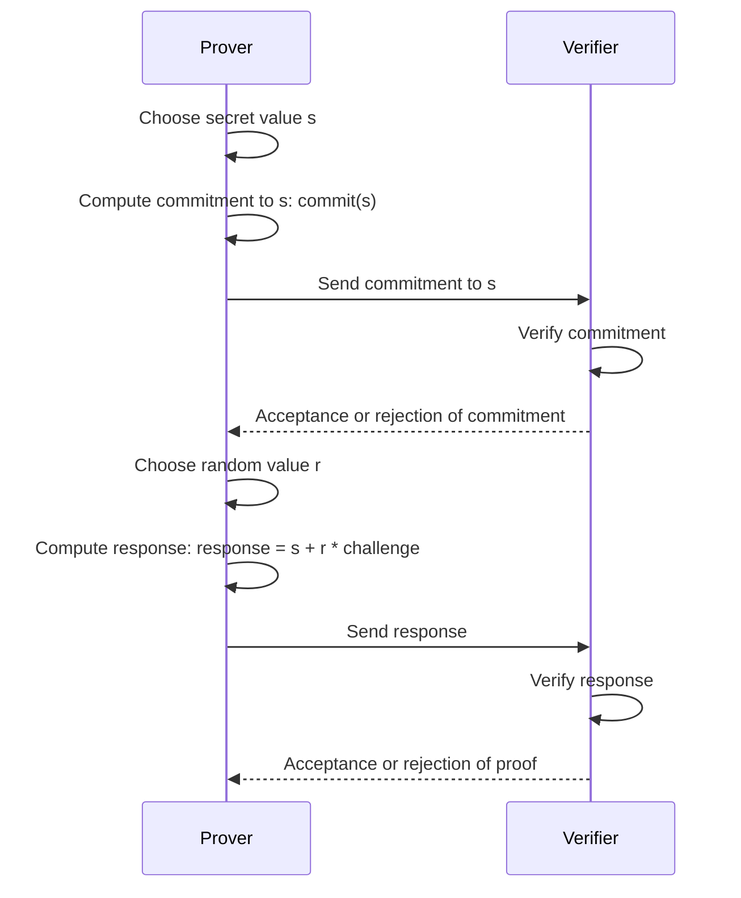

Here's the Mermaid diagram for the secret commitment ceremony algorithm including Alice, Bob, and Victor stages:

This diagram illustrates the process of a secret commitment ceremony involving Alice, Bob, and Victor, including the stages of choosing secret values, computing commitments, sending commitments to Victor, Victor receiving commitments, sending challenges, receiving responses, verifying responses and commitments, and announcing the result.

----

## Greek Symbol Key
- $\alpha$: Input variables, representing initial values or keys.
- $\Phi$: General transformation or function.
- $\Psi$: XOR logic operation or another binary operation.
- $\Lambda$: Function for key generation.
- $\Omega$: Encryption function.
- $\Theta$: Decryption function.
- $\eta, \xi$: Large prime numbers or composite numbers.
- $\Gamma$: Function for pseudo-random values or sequences.

This sequence diagram illustrates the Diffie-Hellman key exchange algorithm. Both Alice and Bob generate their private keys (a and b, respectively) and then exchange their public keys calculated using these private keys. The shared secret is then independently computed by each party using the other party's public key and their own private key.

----

This sequence diagram illustrates the RSA key exchange algorithm. Alice generates two large prime numbers, calculates the public modulus (n), chooses a public exponent (e), and publishes these as her public key. Bob encrypts a message using Alice's public key and sends it to Alice. Alice decrypts the message using her private key.

----

The  diagram depicting a basic Sigma Schnorr ceremony algorithm, including the commitment stage:

This diagram illustrates the Sigma Schnorr ceremony algorithm. The Prover first selects a random value \( k \) and computes a commitment to it. Then, the Prover and Verifier interact to verify the commitment, generate a challenge based on the message and commitment, and respond accordingly. The Verifier ultimately verifies the response and either accepts or rejects the proof. If rejected, the Prover repeats the process with a new random value \( k \).

This sequence diagram illustrates Schnorr's Sigma algorithm. The Prover generates a random private key, computes the corresponding public key, and sends it to the Verifier. The Verifier then sends a challenge to the Prover. The Prover computes a response based on the challenge and sends it back to the Verifier. Finally, the Verifier verifies the response based on predefined criteria.

----

This  mermaid diagram illustrates a basic Zero-Knowledge Proof (ZKP) algorithm, including the commitment stage. The Prover first selects a secret value and computes a commitment to it. This commitment is then sent to the Verifier, who verifies it. After verification, the Prover generates a response based on a challenge from the Verifier and sends it back. Finally, the Verifier verifies the response and either accepts or rejects the proof.

----

This sequence diagram outlines a basic Zero-Knowledge Proof (ZKP) algorithm, including the commitment stage. The Prover selects a secret value and computes a commitment to it, which is sent to the Verifier. After verifying the commitment, the Verifier either accepts or rejects it. Then, the Prover generates a response based on a challenge from the Verifier, which is sent back for verification. Finally, the Verifier evaluates the response and either accepts or rejects the proof.
