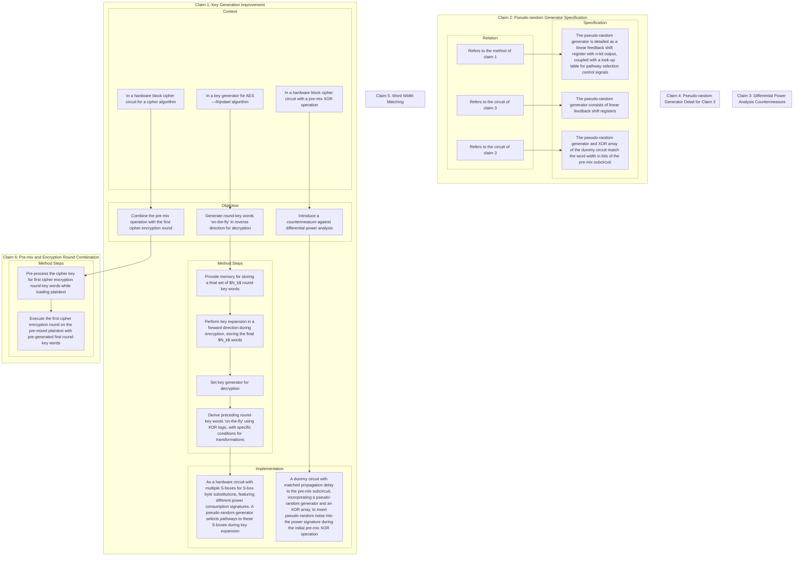

```mermaid
flowchart TD
    subgraph "Claim 1: Key Generation Improvement"
        subgraph "Context"
            c1["In a key generator for AES—Rijndael algorithm"]
        end
        subgraph "Objective"
            c2["Generate round-key words 'on-the-fly' in reverse direction for decryption"]
        end
        subgraph "Method Steps"
            c3["Provide memory for storing a final set of $N_k$ round-key words"]
            c4["Perform key expansion in a forward direction during encryption, storing the final $N_k$ words"]
            c5["Set key generator for decryption"]
            c6["Derive preceding round-key words 'on-the-fly' using XOR logic, with specific conditions for transformations"]
        end
        subgraph "Implementation"
            c7["As a hardware circuit with multiple S-boxes for S-box byte substitutions, featuring different power consumption signatures. A pseudo-random generator selects pathways to these S-boxes during key expansion"]
        end
        c1 --> c2
        c2 --> c3
        c3 --> c4
        c4 --> c5
        c5 --> c6
        c6 --> c7
    end
    subgraph "Claim 2: Pseudo-random Generator Specification"
        subgraph "Relation"
            c8["Refers to the method of claim 1"]
        end
        subgraph "Specification"
            c9["The pseudo-random generator is detailed as a linear feedback shift register with n-bit output, coupled with a look-up table for pathway selection control signals"]
        end
        c8 --> c9
    end
    subgraph "Claim 3: Differential Power Analysis Countermeasure"
        subgraph "Context"
            c10["In a hardware block cipher circuit with a pre-mix XOR operation"]
        end
        subgraph "Objective"
            c11["Introduce a countermeasure against differential power analysis"]
        end
        subgraph "Implementation"
            c12["A dummy circuit with matched propagation delay to the pre-mix subcircuit, incorporating a pseudo-random generator and an XOR array, to insert pseudo-random noise into the power signature during the initial pre-mix XOR operation"]
        end
        c10 --> c11
        c11 --> c12
    end
    subgraph "Claim 4: Pseudo-random Generator Detail for Claim 3"
        subgraph "Relation"
            c13["Refers to the circuit of claim 3"]
        end
        subgraph "Specification"
            c14["The pseudo-random generator consists of linear feedback shift registers"]
        end
        c13 --> c14
    end
    subgraph "Claim 5: Word Width Matching"
        subgraph "Relation"
            c15["Refers to the circuit of claim 3"]
        end
        subgraph "Specification"
            c16["The pseudo-random generator and XOR array of the dummy circuit match the word width in bits of the pre-mix subcircuit"]
        end
        c15 --> c16
    end
    subgraph "Claim 6: Pre-mix and Encryption Round Combination"
        subgraph "Context"
            c17["In a hardware block cipher circuit for a cipher algorithm"]
        end
        subgraph "Objective"
            c18["Combine the pre-mix operation with the first cipher encryption round"]
        end
        subgraph "Method Steps"
            c19["Pre-process the cipher key for first cipher encryption round key words while loading plaintext"]
            c20["Execute the first cipher encryption round on the pre-mixed plaintext with pre-generated first round-key words"]
        end
        c17 --> c18
        c18 --> c19
        c19 --> c20
    end
```
