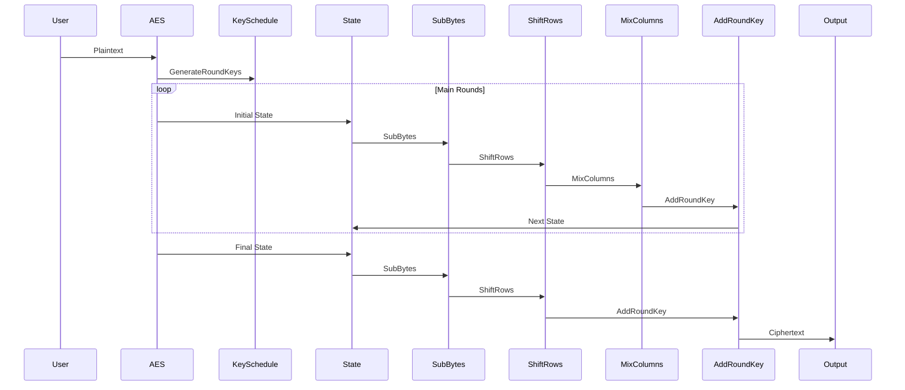
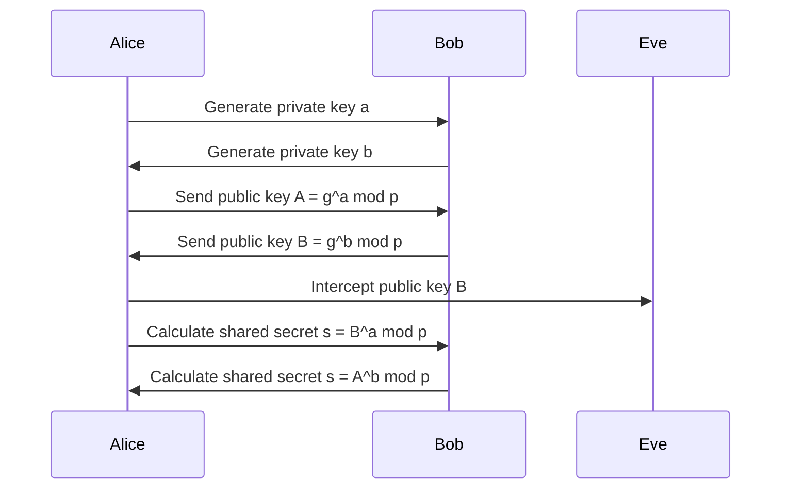

## Greek Symbol Key
- $\alpha$: Input variables, representing initial values or keys.
- $\Phi$: General transformation or function.
- $\Psi$: XOR logic operation or another binary operation.
- $\Lambda$: Function for key generation.
- $\Omega$: Encryption function.
- $\Theta$: Decryption function.
- $\eta, \xi$: Large prime numbers or composite numbers.
- $\Gamma$: Function for pseudo-random values or sequences.

This sequence diagram illustrates the Diffie-Hellman key exchange algorithm. Both Alice and Bob generate their private keys (a and b, respectively) and then exchange their public keys calculated using these private keys. The shared secret is then independently computed by each party using the other party's public key and their own private key.
