Security Primitives & Patterns

1. **[Authentication](https://github.com/eni6ma-org/Fundamental-Cryptography/blob/main/Patterns.md#1-authentication)**: Shows the steps from user input through to system verification of credentials.
2. **[Verification](https://github.com/eni6ma-org/Fundamental-Cryptography/blob/main/Patterns.md#2-verification)**: Details the process from data submission, hash generation, digital signature creation, to verification and outcome.
3. **[Access Control](https://github.com/eni6ma-org/Fundamental-Cryptography/blob/main/Patterns.md#3-access-control)**: Follows the login to the access request, role verification, and access decision.
4. **[Permissions](https://github.com/eni6ma-org/Fundamental-Cryptography/blob/main/Patterns.md#4-permissions)**: Covers the setting up of permissions by an admin to the checking of permissions during a user operation.
5. **[Authority and Rights](https://github.com/eni6ma-org/Fundamental-Cryptography/blob/main/Patterns.md#5-authority-and-rights)**: Details the assignment of rights and checks performed during a user action.
6. **[Voting Ballot](https://github.com/eni6ma-org/Fundamental-Cryptography/blob/main/Patterns.md#6-voting-ballot)**: Follows the process of secure voting from login to encrypted submission.
7. **[Certification](https://github.com/eni6ma-org/Fundamental-Cryptography/blob/main/Patterns.md#7-certification)**: Covers the entire lifecycle of a digital certificate from request to usage and verification.
8. **[Private Identity](https://github.com/eni6ma-org/Fundamental-Cryptography/blob/main/Patterns.md#8-private-identity)**: Describes steps involved in creating and managing a private identity securely.
9. **[Sovereign Identity](https://github.com/eni6ma-org/Fundamental-Cryptography/blob/main/Patterns.md#9-sovereign-identity)**: Outlines the creation and management of a sovereign identity using blockchain technology.
10. **[Single Sign-On (SSO)](https://github.com/eni6ma-org/Fundamental-Cryptography/blob/main/Patterns.md#10-single-sign-on-sso)**: Shows the process from initial login through to token verification and access outcome.
11. **Consensus**: Details the steps from transaction initiation to the consensus process and final blockchain update.
12. **Authority**: Follows the role assignment to the authentication, authorization, and access decision processes, including audit logging.
13. **Provenance**: Covers everything from data creation, processing, and review to audits and decision-making based on verified data.
14. **Non-Repudiation**: Describes the sequence from message creation and digital signing to signature verification and validation of non-denial.
15. **Validation of Ownership**: Shows the steps from ownership claim through credential verification to the validation of ownership based on matching credentials and rights.
16. **Verification of Ledger Log**: Details the process from transaction initiation, through authentication and signing, to the consensus process and final ledger update.
17. **Irrefutable Evidence**: Covers the sequence from data capture, cryptographic sealing, secure storage, to the availability of verification tools and the use of data in legal and compliance contexts.

# 1. Authentication
Authentication is the process of verifying the identity of a user, device, or entity before granting access to a system or resource. It often involves validating credentials such as passwords, digital certificates, or biometric data against a known record. In cryptography and security, authentication ensures that an entity is who it claims to be, preventing unauthorized access and enabling secure communication.

#### Example Sequence Steps
1. User Action: The user inputs their username and password on the login page of the system.
2. System Action: The system retrieves the salt and hashed password associated with the entered username from the database.
3. Hashing Process: The system hashes the entered password concatenated with the salt.
4. Verification: The system compares the newly generated hash with the stored hash.
5. Outcome: If they match, the system authenticates the user and grants access. If they don’t match, access is denied.

### **Example Authentication Flow**
Shows the steps from user input through to system verification of credentials.

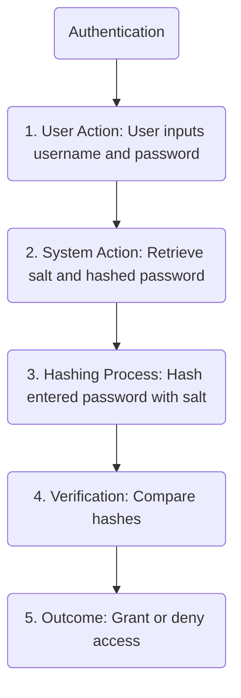
---

# 2. Verification
Verification refers to the process of confirming the truth, accuracy, or validity of something. In the context of information security, it often relates to checking the integrity and authenticity of data or software. Verification ensures that information has not been altered or tampered with, typically using cryptographic hashes or digital signatures.

#### Example Sequence Steps
1. Data Submission: A user submits a document via an online portal.
2. System Action: The system calculates a hash of the document using a cryptographic hash function.
3. Signature Generation: The user’s private key is used to encrypt the hash, creating a digital signature.
4. Verification Process: The receiver uses the user’s public key to decrypt the digital signature to retrieve the hash.
5. Outcome: The receiver recalculates the hash of the original document and compares it with the decrypted hash. If they match, the document’s integrity and authenticity are confirmed.

### **Example Flow**: 
Details the process from data submission, hash generation, digital signature creation, to verification and outcome.

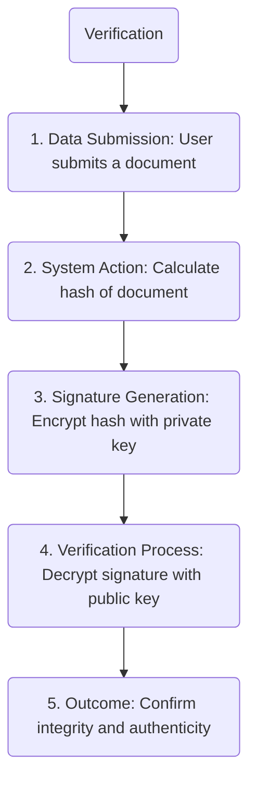

---

# 3. Access Control
Access control is a security technique that regulates who or what can view or use resources in a computing environment. It is a fundamental concept in security that minimizes risk to the business or organization. Mechanisms like role-based access control (RBAC) and mandatory access control (MAC) are used to enforce access policies, determining how users can interact with resources based on permissions.

#### Example Sequence Steps
1. User Login: User logs into the system successfully after authentication.
2. Role Retrieval: The system retrieves the user’s role(s) from the user database.
3. Request: User requests access to a particular resource.
4. Permission Check: System checks the access control list (ACL) to see if the user’s role has the necessary permissions to access the requested resource.
5. Outcome: If the role has appropriate permissions, access is granted. Otherwise, access is denied.

####  **Access Control Flow**: 
Follows the login to the access request, role verification, and access decision.

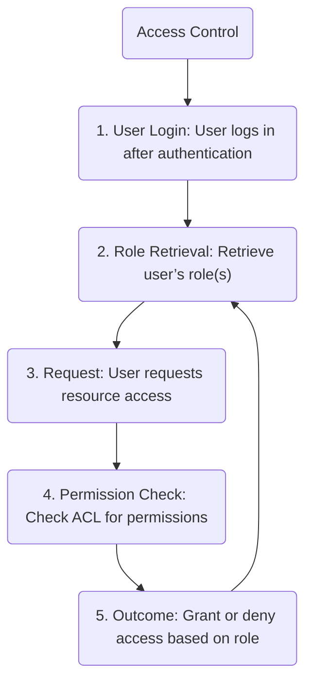

---

# 4. Permissions
Permissions are settings that determine the level of access a user, group, or process has to operating system resources, files, or data. They help enforce policies in access control systems, ensuring that users can only perform actions that are necessary for their role or tasks.

#### Example Sequence Steps
1. Admin Setup: An administrator configures permissions for a file system or database specifying which user roles can read, write, or execute.
2. User Action: A user attempts to perform an operation on the resource (e.g., read a file).
3. Check Permissions: The system checks the user's role against the permissions set on the resource.
4. Outcome: The system either allows the operation if the permissions match or denies it if they do not.

### **Permissions Flow**: 
Covers the setting up of permissions by an admin to the checking of permissions during a user operation.

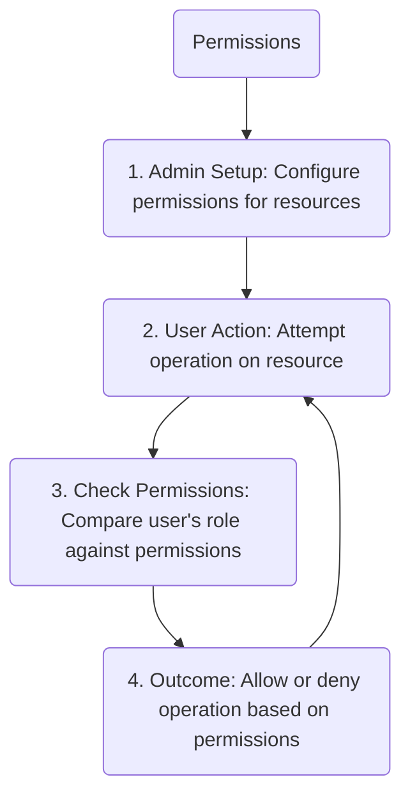

--- 

# 5. Authority and Rights
Authority refers to the power or right given to users or processes to perform certain actions within a system, like issuing commands or modifying data. Rights are the specific privileges or permissions granted to users or processes. Both concepts are crucial in defining roles and responsibilities within an organization's IT environment.

#### Example Sequence Steps
1. Assignment: An administrator assigns specific rights to a user, such as the right to approve financial transactions.
2. User Action: The user attempts to approve a transaction.
3. Rights Verification: The system checks whether the user has the necessary rights to perform this action.
4. Outcome: If the user has the rights, the action is executed. If not, the action is blocked.

### **Authority and Rights Flow**: 
Details the assignment of rights and checks performed during a user action.
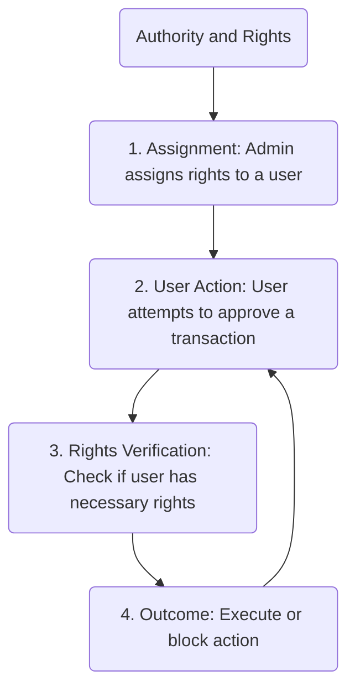

--- 

# 6. Voting Ballot
In the digital realm, a voting ballot refers to an electronic method used to cast votes in an election or survey. Cryptography ensures that the voting process is secure, anonymous, and tamper-resistant, preserving the integrity and confidentiality of the vote.

#### Example Sequence Steps
1. Voter Login: Voter logs into the digital voting system using secure authentication.
2. Ballot Selection: The voter selects their candidates on the electronic ballot.
3. Encryption: The voter’s choices are encrypted with a public key specific to the voting session.
4. Submission: The encrypted vote is submitted to the server.
5. Outcome: The server stores the encrypted vote securely until the end of the voting period, ensuring confidentiality and integrity.

###  **Voting Ballot Flow**: 
Follows the process of secure voting from login to encrypted submission.
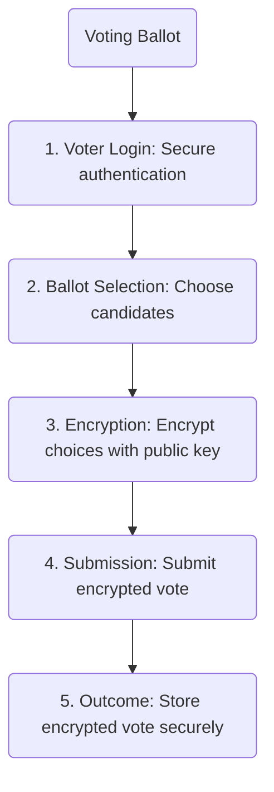

--- 

# 7. Certification
Certification in IT and security often refers to the process of verifying the compliance of hardware, software, or systems with certain standards or criteria. It can also mean issuing a digital certificate which proves the identity of entities or the authenticity of objects on a network, enhancing security through encryption and access controls.

#### Example Sequence Steps
1. Request: An entity requests a digital certificate from a Certificate Authority (CA).
2. Validation: The CA verifies the entity’s identity and other credentials.
3. Certificate Issuance: Upon successful verification, the CA issues a digital certificate, signing it with the CA’s private key.
4. Usage: The entity uses the certificate to prove identity or secure communications.
5. Verification: Others can verify the certificate using the CA’s public key.

### **Certification Flow**: 
Covers the entire lifecycle of a digital certificate from request to usage and verification.
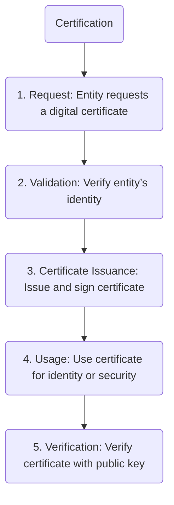

--- 

# 8. Private Identity
A private identity is an identity used within a specific context or organization that contains personal or sensitive information. It is crucial to protect such identities using strong authentication and privacy-preserving technologies to prevent identity theft and unauthorized access.

#### Example Sequence Steps
1. Identity Creation: A user creates a private identity profile on a secure platform, providing sensitive personal information.
2. Encryption: All personal data is encrypted and stored securely.
3. Authentication: Whenever access to the private identity is required, strong multi-factor authentication is enforced.
4. Access Control: Strict permissions are set who can view or use the identity information.
5. Monitoring: Continuous monitoring for unauthorized access or anomalies is implemented.

### **Private Identity Flow**: 
Describes steps involved in creating and managing a private identity securely.
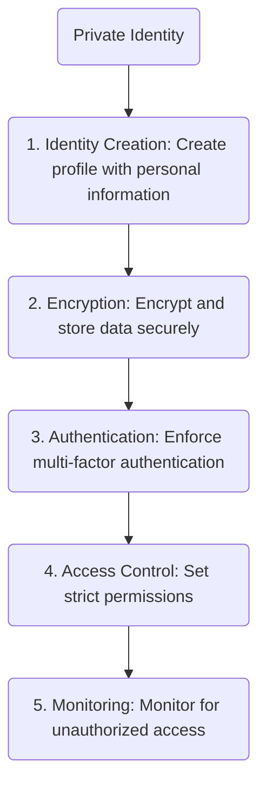

--- 

# 9. Sovereign Identity
Sovereign identity refers to a user-centric identity model that allows individuals to own, control, and present their identity information across various services without relying on a central authority. It uses cryptographic techniques for secure, portable identity verification, often implemented through blockchain technology.

#### Example Sequence Steps
1. Identity Record Creation: A user creates their identity record using a decentralized identity application.
2. Blockchain Storage: The identity record is stored on a blockchain, ensuring it is tamper-resistant.
3. Control: The user controls access to their identity information using private keys.
4. Usage: The user can present proofs of their identity to services that require verification without revealing unnecessary information.
5. Verification: Service providers verify the proofs against the blockchain without needing access to the actual data.

### **Sovereign Identity Flow**: 
Outlines the creation and management of a sovereign identity using blockchain technology.

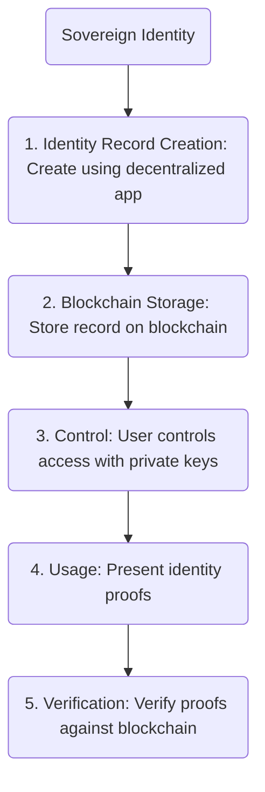

--- 

# 10. Single Sign-On (SSO)
Single Sign-On (SSO) is an authentication process that allows a user to access multiple applications or systems with one set of credentials. This simplifies the user experience and enhances security by reducing the number of passwords users must manage and potentially expose to risk.

#### Example Sequence Steps
1. Initial Login: The user logs into the SSO provider with their credentials.
2. Authentication: The SSO system authenticates the user and generates a security token.
3. Token Presentation: The user accesses a different application and presents the token instead of logging in again.
4. Token Verification: The application verifies the token with the SSO provider.
5. Outcome: Upon successful verification, the user is granted access to the application without needing to re-authenticate.
   
### 10. **Single Sign-On (SSO)**: 
Shows the process from initial login through to token verification and access outcome.

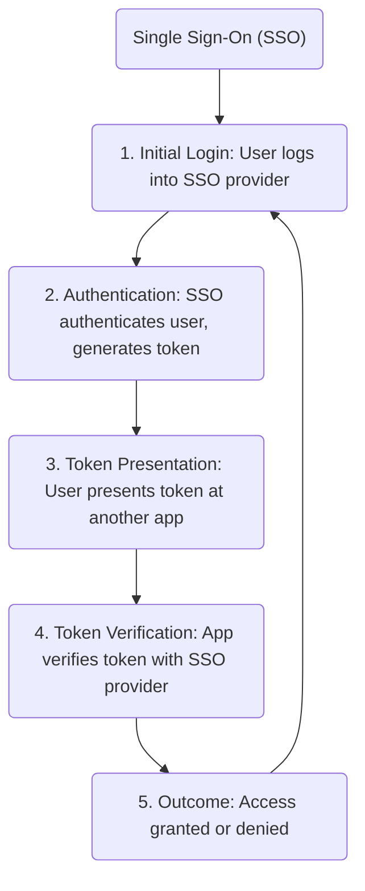

--- 

# 11. Consensus
Consensus in the context of distributed systems, particularly blockchain and decentralized technologies, refers to the agreement among network nodes on the validity and state of a piece of data or transaction. This mechanism is crucial to maintain a unified ledger in environments without a central authority, ensuring that all copies of the distributed database are synchronized. Consensus algorithms, such as Proof of Work (PoW) or Proof of Stake (PoS), help resolve conflicts and prevent issues like double-spending by agreeing on a single history of transactions.

#### Example Sequences
1. Transaction Initiation: A user initiates a transaction, which is broadcast to all nodes in the network.
2. Validation: Each node in the network validates the transaction based on predefined rules (e.g., sufficient balance, correct digital signatures).
3. Block Formation: Once validated, the transaction is included in a new block, which nodes attempt to add to the blockchain.
4. Consensus Process: Nodes participate in a consensus process (e.g., solving a cryptographic puzzle in PoW or selecting a leader in PoS) to agree on which block gets added to the chain.
5. Chain Update: Once consensus is achieved, the winning block is added to the blockchain, and all nodes update their copies of the ledger.

###  **Consensus Flow**: 
Details the steps from transaction initiation to the consensus process and final blockchain update.

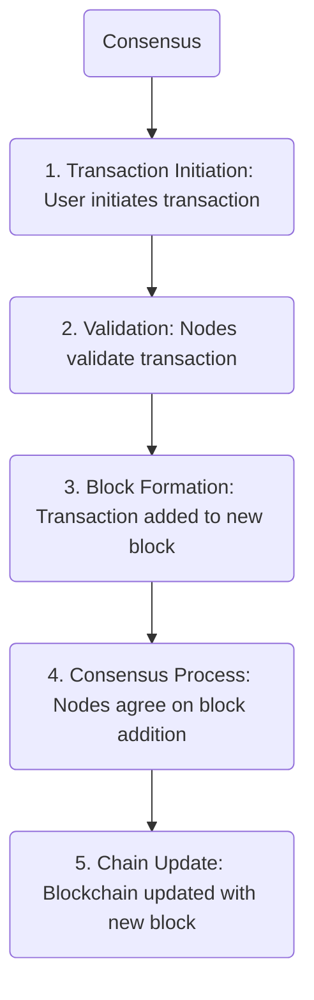

--- 

# 12. Authority
Authority in systems and network security refers to the entity or mechanism responsible for controlling, regulating, or managing access rights and permissions within a system. Authority can be centralized, such as in a traditional hierarchical organization where decisions are made by a single administrative entity, or decentralized, where control is distributed among multiple parties or nodes. In cybersecurity, authority also relates to entities that issue digital certificates, like Certificate Authorities (CA), which validate the identity of other entities within the network.

#### Example Sequences
1. Role Assignment: An administrator assigns roles to users within an organization, specifying the permissions associated with each role.
2. Resource Request: A user attempts to access a resource within the system.
3. Authentication and Authorization: The system verifies the user's identity and then checks their role to determine if they have the necessary authority to access the resource.
4. Access Decision: Based on the user's authority, the system grants or denies access to the resource.
5. Audit Logging: All access attempts and decisions are logged for future audit and compliance review.

### **Authority Flow**: 
Follows the role assignment to the authentication, authorization, and access decision processes, including audit logging.

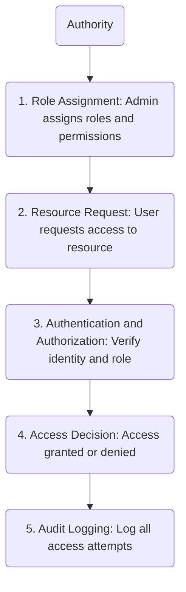

--- 

# 13. Provenance
Provenance in information systems refers to the chronology of the ownership, custody, or location of an object, often providing a detailed history of the data including where it originated and the process it has undergone. Provenance is used extensively in data science, digital archives, and blockchain applications to ensure data integrity, auditability, and compliance. It allows users to verify that the data has not been altered inappropriately and to trace back to the source of information for validation purposes.

#### Example Sequences
1. Data Creation: Data is created or imported into the system, and initial provenance records are established, detailing the source and nature of the data.
2. Data Processing: As the data is processed or modified, each action is recorded in the provenance log, capturing details about the process and the identity of the actor involved.
3. Provenance Review: Users or systems can review the provenance logs to trace the history of the data, verify its integrity, and ensure compliance with regulatory standards.
4. Audit: External auditors may periodically review the provenance logs to ensure that the data has been handled appropriately and that all changes are accounted for.
5. Decision Making: Decision-makers use the verified provenance to make informed decisions based on the authentic and unaltered history of the data.

### **Provenance Flow**: 
Covers everything from data creation, processing, and review to audits and decision-making based on verified data.

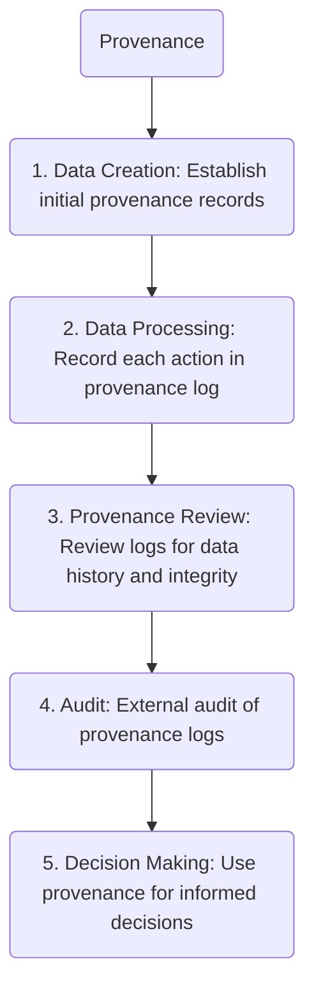

--- 

# 14. Non-Repudiation
Non-repudiation in cybersecurity and digital communications ensures that a party in a transaction cannot deny the authenticity of their signature on a message or the sending party of a message that it originated from. This is crucial for legal, business, and security contexts where it is important to prove that a specific action occurred and that the party involved cannot dispute their participation. Non-repudiation is often implemented using cryptographic techniques like digital signatures, where the signing party’s private key generates a signature that can be independently verified by anyone with access to the public key.

#### Example Sequences
1. Message Creation: A user composes a message intended for another party.
2. Digital Signing: The user digitally signs the message using their private key, creating a signature that encapsulates the message data.
3. Message Transmission: The signed message is sent to the recipient.
4. Signature Verification: Upon receiving the message, the recipient uses the sender’s public key to verify the signature.
5. Outcome: If the signature is valid, the recipient can be confident the message was indeed sent by the claimed sender, who cannot deny sending the message.

### **Non-Repudiation Flow**: 
Describes the sequence from message creation and digital signing to signature verification and validation of non-denial.
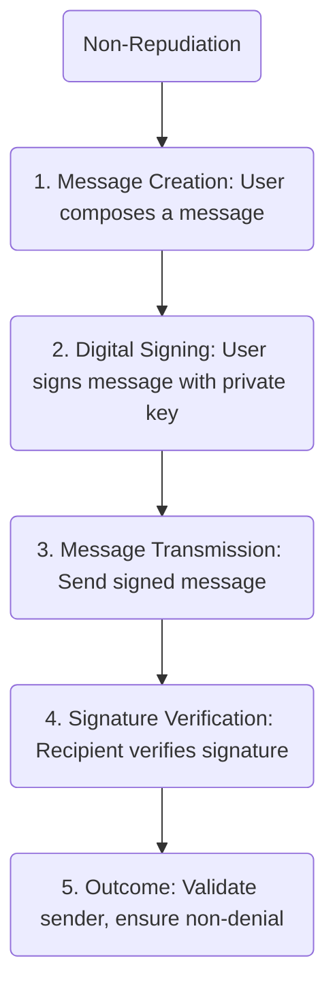

--- 

# 15. Validation of Ownership
Validation of ownership refers to the process of proving that a particular entity owns a specific resource or asset. In digital systems, this often involves cryptographic methods to verify that the person claiming to own a digital asset, such as digital tokens, software licenses, or online identities, indeed holds the correct credentials or cryptographic keys associated with the ownership. Validation of ownership is fundamental in areas such as digital rights management (DRM), blockchain transactions, and access to secured digital content.

#### Example Sequences
1. Ownership Claim: A user claims ownership of a digital asset by presenting their digital certificate or cryptographic token.
2. Credential Verification: The system verifies the cryptographic evidence (e.g., matching a public key to a signed token).
3. Rights and Privileges Check: The system checks the database to ensure the cryptographic credentials are linked to the rights and privileges associated with the asset.
4. Outcome: If the credentials are verified and match the ownership records, the system validates the user’s ownership claim.

### **Validation of Ownership Flow**: 
Shows the steps from ownership claim through credential verification to the validation of ownership based on matching credentials and rights.
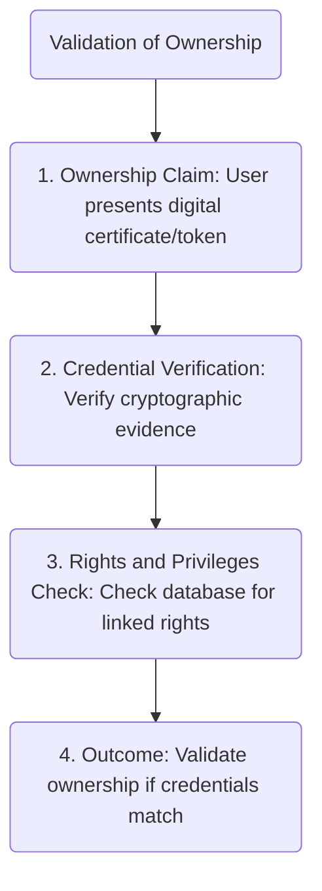

---

# 16. Verification of Data
Verification of CRUD (Create, Read, Update, Delete) methods on an arbitrary ledger log involves ensuring that any operations performed on the ledger are authenticated, authorized, and consistent with the ledger’s rules. In distributed ledgers, such as blockchains, this verification process includes checking that the transaction blocks (which could contain CRUD operations) are correctly signed, valid according to the consensus rules, and properly linked to the blockchain. This ensures the integrity and continuity of the ledger.

#### Example Sequences
1. Transaction Initiation: A user attempts to perform a CRUD operation on the ledger.
2. Operation Authentication: The system verifies the user’s credentials and rights to perform the requested operation.
3. Transaction Signing: The CRUD operation details are signed by the user’s private key.
4. Consensus Process: The operation is submitted to the ledger network, where nodes run consensus algorithms to validate the transaction.
5. Ledger Update: Once validated by consensus, the CRUD operation is committed to the ledger, ensuring it is part of the immutable log.

###  **Verification of Data Flow**: 
1. Details the process from transaction initiation, through authentication and signing, to the consensus process and final ledger update.
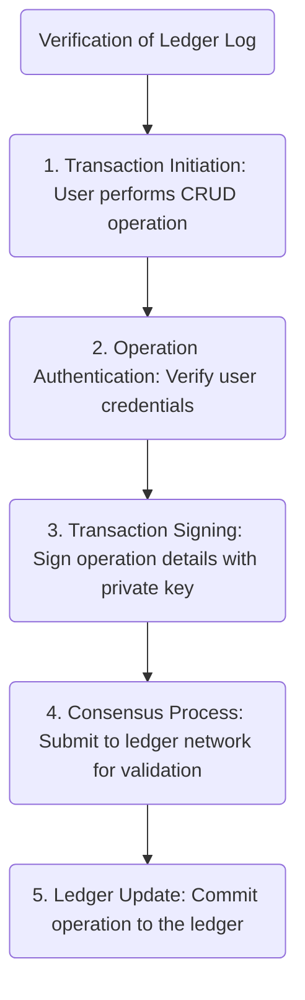

---

# 17. Irrefutable Evidence
Irrefutable evidence in the context of digital systems refers to data or information that is so securely captured and stored that it cannot be disputed. This often involves using cryptographic techniques to seal and timestamp data, thereby providing a tamper-proof record that can be critical in legal disputes, financial audits, or security incident investigations. Irrefutable evidence is crucial for ensuring that records, once written, remain unchanged and are easily verifiable by third parties without any possibility of tampering.

#### Example Sequences
1. Data Capture: Relevant data (e.g., transaction logs, video feed, sensor data) is captured in real-time.
2. Cryptographic Sealing: The data is immediately hashed and sealed with a cryptographic signature and timestamp.
3. Secure Storage: The sealed data is stored in a secure, tamper-proof environment.
4. Verification Availability: Tools and cryptographic keys are made available to authorized parties to verify the data integrity at any point in the future.
5. Legal and Compliance Use: The data can be presented as evidence in legal or compliance matters, with assurances that it hasn’t been altered since the time of capture.

### **Irrefutable Evidence Flow**: 
1. Covers the sequence from data capture, cryptographic sealing, secure storage, to the availability of verification tools and the use of data in legal and compliance contexts.

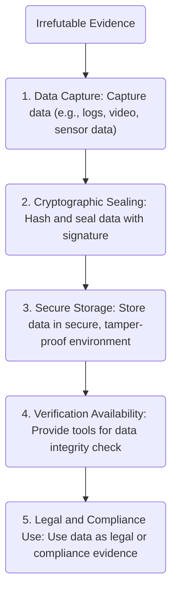
